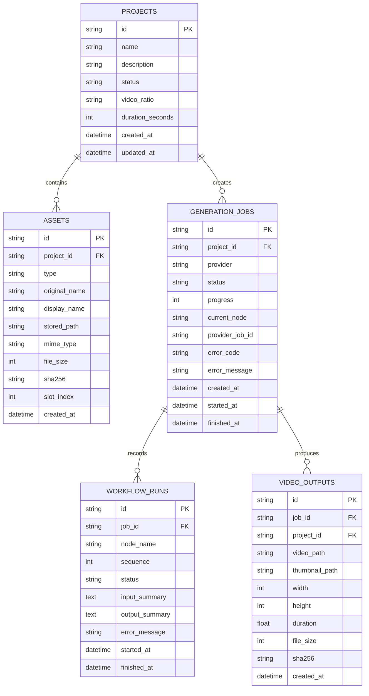

# 电商服装 AI 换装短视频工作流

## 1. 文档信息

- 文档类型：产品需求文档（PRD）
- 版本：v1.0
- 日期：2026-09-29
- 项目性质：面试笔试项目 / 本地可运行的小型 Agent 工作流应用
- 当前阶段：设计确认完成，准备进入开发

## 2. 项目背景

本项目用于完成“电商服装 AI 换装短视频工作流”笔试题。用户上传一张已授权的全身模特图片、三张不同服装商品图片及对应商品名称，系统通过一个可替换的 AI 视频生成 Provider，按照指定顺序生成约 5 秒的竖屏电商换装短视频。

第一版优先保证本地完整运行。由于暂时没有模特图、服装图和硅基流动 API，系统先使用内置示例素材和 Mock Provider 完成可演示的完整流程，之后再接入 SiliconFlow Provider 生成真实视频。

## 3. 笔试题硬性要求

### 3.1 输入要求

- 一张已授权的全身模特图；
- 三张不同服装商品图；
- 三个服装商品名称；
- 支持用户后续替换任意模特图片和服装图片。

### 3.2 视频要求

- 模特依次展示三套服装；
- 保持模特脸部、发型和身材比例基本一致；
- 保持背景和光线基本一致；
- 准确还原服装颜色、版型、纹理、图案和关键设计；
- 换装过程自然；
- 避免闪烁、穿模、身体异常、服装漂移和身份变化；
- 视频时长约 5 秒；
- 视频采用竖屏电商展示比例，默认 9:16。

### 3.3 提交要求

- 可运行的前后端项目；
- README，包含启动方式、技术选型和已完成能力；
- 最终生成视频；
- 在线演示地址作为项目最终交付要求，具体部署方式后续确定；
- 可以说明 AI Token 的使用情况。

## 4. 用户目标和项目目标

### 4.1 用户目标

用户可以在本地工作台中完成以下操作：

1. 创建一个服装换装项目；
2. 上传模特图片和三套服装图片；
3. 设置商品名称和换装顺序；
4. 发起视频生成任务；
5. 查看 LangGraph 工作流执行进度；
6. 预览和下载生成结果；
7. 查询历史任务；
8. 备份和恢复项目数据。

### 4.2 项目目标

- 构建一个完整、可运行、可演示的本地前后端应用；
- 体现 LangGraph 在 AI 工作流中的使用；
- 通过 Provider 抽象层支持后续接入硅基流动；
- 将业务数据和媒体文件保存为电脑上的独立文件；
- 提供可靠的备份与恢复能力；
- 采用完整的电商工作台风格完成页面和交互。

## 5. 已确认的范围

### 5.1 第一版必须完成

- 本地项目创建；
- 项目列表、项目详情和项目状态管理；
- 模特图片上传；
- 三张服装图片上传；
- 商品名称编辑；
- 服装顺序调整；
- 图片预览和文件信息查看；
- Mock 视频生成流程；
- LangGraph 工作流节点执行；
- 生成进度展示；
- 视频预览和下载；
- 历史任务查询；
- ZIP 完整备份；
- ZIP 导入恢复；
- Provider 抽象接口；
- 内置示例素材；
- README 和本地启动脚本。

### 5.2 第一版暂不完成

- 真实服装生成模型；
- SiliconFlow API 的实际接入；
- 多用户登录和权限系统；
- 云端对象存储；
- Redis、Celery 等分布式任务系统；
- 在线协作；
- 自动部署流程；
- 在线演示地址的具体部署方案；
- 商品价格、品牌、商品链接等额外电商字段。

### 5.3 后续接入 SiliconFlow 时完成

- SiliconFlow Provider；
- API Key 环境变量配置；
- API 配置校验；
- 异步任务提交；
- 生成状态轮询；
- 真实视频下载；
- 失败重试和超时处理。

## 6. 确定的技术栈

### 6.1 前端

- React
- TypeScript
- Vite
- Ant Design
- TanStack Query
- 自定义 CSS

### 6.2 后端

- Python
- FastAPI
- Uvicorn
- Pydantic
- SQLAlchemy 2
- Alembic

### 6.3 Agent 工作流

- LangGraph
- SQLite Checkpointer 或等价的本地持久化 Checkpointer

### 6.4 数据和文件

- SQLite：保存结构化业务数据；
- 本地文件系统：保存图片、视频、封面和备份；
- ZIP：完整项目备份和恢复；
- 本地 Git：保存源代码、配置和开发版本。

### 6.5 AI Provider

- `MockVideoProvider`：第一版默认 Provider；
- `SiliconFlowVideoProvider`：后续接入；
- 业务层只依赖统一 Provider 接口，不直接依赖具体厂商 API。

## 7. 系统结构

```text
React + Ant Design 前端
        │ REST API
        ▼
FastAPI 后端
        │
        ▼
LangGraph 工作流
        │
        ▼
Provider 抽象层
  Mock / SiliconFlow
        │
        ▼
SQLite + 本地文件系统
```

前端不直接访问 AI 服务，所有生成请求通过 FastAPI 进入 LangGraph，再由 Provider 处理。

## 8. 页面结构和交互设计

### 8.1 全局工作台

采用电商运营后台布局：

- 左侧固定导航；
- 顶部显示当前项目、运行模式和快捷操作；
- 中央区域显示当前页面；
- 右侧使用抽屉或弹窗显示详情和操作反馈。

侧边栏菜单：

- 工作台；
- 换装项目；
- 素材库；
- 生成记录；
- 备份与恢复；
- 系统设置。

顶部栏显示：

- 当前项目名称；
- 演示模式 / AI 模式；
- 数据存储状态；
- 创建换装任务按钮。

### 8.2 工作台首页 `/dashboard`

内容：

- 项目总数；
- 素材总数；
- 生成任务总数；
- 成功生成数量；
- 最近项目；
- 最近生成任务；
- 当前正在执行的任务。

交互：

- 点击项目卡片进入项目详情；
- 点击任务进入任务进度页；
- 点击快捷按钮创建任务；
- 失败任务提供重试入口。

### 8.3 项目列表 `/projects`

字段：

- 项目名称；
- 项目状态；
- 模特素材数量；
- 服装素材数量；
- 最近生成时间；
- 最后更新时间；
- 操作。

操作：

- 新建；
- 查看；
- 重命名；
- 复制；
- 删除；
- 归档。

项目状态：

```text
草稿 / 素材已就绪 / 生成中 / 已完成 / 生成失败 / 已归档
```

### 8.4 创建项目 `/projects/new`

表单：

- 项目名称；
- 项目描述；
- 模特图上传；
- 三张服装图上传；
- 三个商品名称；
- 服装顺序；
- 视频比例；
- 视频时长；
- 生成模式。

默认值：

```text
视频比例：9:16
视频时长：5 秒
服装数量：3 套
生成模式：演示模式
```

交互：

- 模特图只能上传一张；
- 服装图必须上传三张；
- 支持 PNG、JPG、JPEG、WEBP；
- 前端显示预览；
- 后端再次校验文件类型和文件内容；
- 支持拖拽调整服装顺序；
- 未满足素材要求时不能开始生成。

### 8.5 项目详情 `/projects/:projectId`

使用 Tab：

- 项目概览；
- 素材管理；
- 生成任务；
- 输出视频；
- 工作流日志。

项目概览显示项目状态、素材缩略图、最近任务和最近视频。

素材管理支持预览、改名、调整顺序、替换和删除。

生成任务显示状态、进度、当前节点、耗时、失败原因和重试按钮。

输出视频显示封面、视频预览、时长、分辨率、生成时间和下载按钮。

工作流日志展示 LangGraph 节点的执行过程。

### 8.6 创建生成任务 `/projects/:projectId/generate`

页面区域：

1. 素材确认区；
2. 生成参数区；
3. 生成规则区；
4. 操作区。

内置生成规则：

- 保持模特身份一致；
- 保持脸部、发型和身材比例；
- 保持背景和光照基本一致；
- 还原服装颜色、版型、纹理、图案和关键设计；
- 避免服装漂移和身体异常；
- 三套服装依次展示。

### 8.7 生成进度 `/jobs/:jobId`

步骤：

```text
素材校验 → 提示词准备 → 提交视频任务 → 等待生成 → 下载视频 → 生成封面 → 完成
```

第一版使用前端轮询，每 1.5 秒获取一次任务状态。任务完成或失败后停止轮询。

支持：

- 取消任务；
- 重新生成；
- 返回项目详情；
- 查看工作流日志。

### 8.8 生成记录 `/history`

支持按项目、状态、生成模式、时间范围和 Provider 筛选。

列表显示项目名称、生成模式、状态、进度、视频时长、创建时间和操作。

### 8.9 素材库 `/assets`

支持按模特图、服装图、项目、文件类型和上传时间筛选。

支持图片预览、查看所属项目、查看文件信息和删除未被任务引用的素材。

### 8.10 备份与恢复 `/backups`

支持：

- 创建完整备份；
- 下载 ZIP；
- 查看备份记录；
- 导入 ZIP；
- 恢复项目；
- 删除备份；
- 校验备份完整性。

导入时先恢复到临时目录，完成文件和 SHA256 校验后再替换正式数据。

### 8.11 系统设置 `/settings`

内容：

- 当前生成模式；
- 当前 Provider；
- 数据目录；
- 文件大小限制；
- Mock Provider 状态；
- SiliconFlow 配置入口；
- 系统健康状态。

API Key 只通过环境变量读取，不写入前端和普通业务表。

## 9. 后端接口清单

统一前缀：`/api`

统一成功响应：

```json
{
  "success": true,
  "data": {},
  "message": "操作成功",
  "request_id": "请求编号"
}
```

统一错误响应：

```json
{
  "success": false,
  "error": {
    "code": "ASSET_COUNT_INVALID",
    "message": "必须上传 3 件服装"
  },
  "request_id": "请求编号"
}
```

### 9.1 系统接口

| 方法 | 路径 | 作用 |
|---|---|---|
| GET | `/api/health` | 检查后端状态 |
| GET | `/api/system/info` | 获取版本、模式、数据目录 |
| GET | `/api/system/storage` | 获取磁盘和数据占用 |

### 9.2 首页接口

| 方法 | 路径 | 作用 |
|---|---|---|
| GET | `/api/dashboard/summary` | 获取首页统计 |
| GET | `/api/dashboard/recent-projects` | 获取最近项目 |
| GET | `/api/dashboard/recent-jobs` | 获取最近任务 |

### 9.3 项目接口

| 方法 | 路径 | 作用 |
|---|---|---|
| GET | `/api/projects` | 获取项目列表 |
| POST | `/api/projects` | 创建项目 |
| GET | `/api/projects/{project_id}` | 获取项目详情 |
| PATCH | `/api/projects/{project_id}` | 修改项目基本信息 |
| DELETE | `/api/projects/{project_id}` | 删除项目 |
| POST | `/api/projects/{project_id}/duplicate` | 复制项目 |
| POST | `/api/projects/{project_id}/archive` | 归档项目 |

创建项目请求：

```json
{
  "name": "春季女装换装展示",
  "description": "三套春季女装短视频",
  "video_ratio": "9:16",
  "duration_seconds": 5
}
```

### 9.4 素材接口

| 方法 | 路径 | 作用 |
|---|---|---|
| GET | `/api/projects/{project_id}/assets` | 获取项目素材 |
| POST | `/api/projects/{project_id}/assets/model` | 上传模特图 |
| POST | `/api/projects/{project_id}/assets/clothing` | 上传服装图 |
| PATCH | `/api/assets/{asset_id}` | 修改名称或顺序 |
| DELETE | `/api/assets/{asset_id}` | 删除素材 |
| POST | `/api/projects/{project_id}/assets/reorder` | 调整服装顺序 |
| GET | `/api/assets/{asset_id}/file` | 获取素材文件 |
| GET | `/api/assets/{asset_id}/thumbnail` | 获取素材缩略图 |

服装上传采用 `multipart/form-data`：

```text
file: 图片文件
name: 商品名称
slot_index: 0 / 1 / 2
```

### 9.5 任务接口

| 方法 | 路径 | 作用 |
|---|---|---|
| GET | `/api/jobs` | 获取任务列表 |
| POST | `/api/projects/{project_id}/jobs` | 创建生成任务 |
| GET | `/api/jobs/{job_id}` | 获取任务详情 |
| POST | `/api/jobs/{job_id}/cancel` | 取消任务 |
| POST | `/api/jobs/{job_id}/retry` | 重试任务 |
| DELETE | `/api/jobs/{job_id}` | 删除任务 |
| GET | `/api/jobs/{job_id}/logs` | 获取工作流日志 |

创建任务请求：

```json
{
  "provider": "mock",
  "video_ratio": "9:16",
  "duration_seconds": 5,
  "transition_style": "natural",
  "clothing_order": [
    "asset-id-1",
    "asset-id-2",
    "asset-id-3"
  ]
}
```

任务状态：

```text
queued / validating / preparing / submitted / processing / succeeded / failed / canceled
```

### 9.6 输出接口

| 方法 | 路径 | 作用 |
|---|---|---|
| GET | `/api/jobs/{job_id}/outputs` | 获取任务输出 |
| GET | `/api/outputs/{output_id}/video` | 播放或下载视频 |
| GET | `/api/outputs/{output_id}/thumbnail` | 获取视频封面 |
| DELETE | `/api/outputs/{output_id}` | 删除视频输出 |

### 9.7 备份接口

| 方法 | 路径 | 作用 |
|---|---|---|
| GET | `/api/backups` | 获取备份列表 |
| POST | `/api/backups/export` | 创建备份 |
| GET | `/api/backups/{backup_id}/download` | 下载备份 |
| POST | `/api/backups/import` | 上传备份 |
| POST | `/api/backups/{backup_id}/restore` | 恢复备份 |
| DELETE | `/api/backups/{backup_id}` | 删除备份 |

### 9.8 设置接口

| 方法 | 路径 | 作用 |
|---|---|---|
| GET | `/api/settings` | 获取系统设置 |
| PATCH | `/api/settings` | 修改系统设置 |
| GET | `/api/providers` | 获取 Provider 状态 |
| POST | `/api/providers/{provider}/validate` | 测试 Provider 配置 |

## 10. 数据库设计

### 10.1 关系



### 10.2 `projects`

- `id`：UUID 主键；
- `name`：项目名称；
- `description`：项目描述；
- `status`：项目状态；
- `video_ratio`：视频比例；
- `duration_seconds`：视频时长；
- `created_at`：创建时间；
- `updated_at`：更新时间；
- `archived_at`：归档时间。

### 10.3 `assets`

- `id`：UUID 主键；
- `project_id`：所属项目；
- `type`：`model` 或 `clothing`；
- `original_name`：原始文件名；
- `display_name`：商品名称；
- `stored_path`：相对路径；
- `mime_type`：文件类型；
- `file_size`：文件大小；
- `sha256`：文件校验值；
- `width`、`height`：图片尺寸；
- `slot_index`：服装顺序；
- `created_at`：上传时间。

约束：

- 一个项目最多一个模特图；
- 一个项目最多三张服装图；
- `slot_index` 只能为 0、1、2；
- 服装顺序不能重复；
- 文件路径必须是相对路径，防止路径穿越。

### 10.4 `generation_jobs`

- `id`：UUID 主键；
- `project_id`：所属项目；
- `provider`：`mock` 或 `siliconflow`；
- `status`：任务状态；
- `progress`：0 到 100 的进度；
- `current_node`：当前 LangGraph 节点；
- `provider_job_id`：外部任务编号；
- `workflow_version`：工作流版本；
- `error_code`：错误代码；
- `error_message`：错误信息；
- `created_at`、`started_at`、`finished_at`：时间信息。

### 10.5 `workflow_runs`

记录每一个 LangGraph 节点的执行情况，用于前端展示和问题排查。不保存 API Key 和完整敏感请求内容，只保存可展示的输入摘要和输出摘要。

### 10.6 `video_outputs`

保存输出视频和封面文件的索引，包括文件路径、文件大小、分辨率、时长和 SHA256。

### 10.7 `backup_records`

保存备份 ZIP 的路径、大小、文件数量、版本、校验值和创建时间。

### 10.8 `app_settings`

保存非敏感配置。API Key 不写入此表，而是通过环境变量读取。

## 11. LangGraph 工作流设计

### 11.1 状态结构

```python
{
    "job_id": "...",
    "project_id": "...",
    "asset_ids": [],
    "provider": "mock",
    "prompt": "...",
    "provider_job_id": "...",
    "status": "processing",
    "progress": 60,
    "current_node": "poll_video_job",
    "output_path": None,
    "error": None
}
```

### 11.2 节点流程

```text
START
  ↓
validate_assets
  ↓
prepare_prompt
  ↓
submit_video_job
  ↓
poll_video_job
  ├── processing → 等待后继续查询
  ├── failed     → fail_job
  └── succeeded  → save_output
                         ↓
                     finish_job
                         ↓
                        END
```

### 11.3 Provider 接口

统一支持：

- `validate_config()`；
- `submit_video_job(request)`；
- `get_video_job_status(provider_job_id)`；
- `download_video(provider_job_id)`；
- `cancel_video_job(provider_job_id)`。

Mock Provider 不需要 API Key，模拟任务状态变化并返回内置演示视频。SiliconFlow Provider 后续实现相同接口，不修改前端和业务层。

## 12. 文件和备份设计

项目目录：

```text
project-root/
├── frontend/
├── backend/
├── data/
│   ├── app.db
│   ├── projects/
│   │   └── {project_id}/
│   │       ├── project.json
│   │       ├── assets/
│   │       ├── outputs/
│   │       └── previews/
│   └── backups/
├── scripts/
├── README.md
├── .env.example
├── start.ps1
├── start.bat
└── .gitignore
```

数据库作为结构化数据查询来源，`project.json` 作为项目级可读清单。备份时同时保存数据库、清单、图片和视频。

备份 ZIP：

```text
backup.zip
├── manifest.json
├── app.db
├── projects/
│   └── project-id/
│       ├── project.json
│       ├── assets/
│       └── outputs/
└── metadata/
    └── backup-info.json
```

恢复流程：

1. 校验 ZIP 格式；
2. 读取 `manifest.json`；
3. 校验文件数量和 SHA256；
4. 检查项目 ID 冲突；
5. 允许覆盖或创建副本；
6. 恢复到临时目录；
7. 校验成功后替换正式目录。

## 13. 错误处理

错误代码包括：

```text
PROJECT_NOT_FOUND
ASSET_NOT_FOUND
MODEL_ASSET_REQUIRED
CLOTHING_ASSET_COUNT_INVALID
FILE_TYPE_NOT_SUPPORTED
FILE_TOO_LARGE
INVALID_IMAGE_FILE
JOB_ALREADY_RUNNING
JOB_CANCEL_FAILED
PROVIDER_NOT_CONFIGURED
PROVIDER_SUBMIT_FAILED
PROVIDER_TIMEOUT
OUTPUT_FILE_NOT_FOUND
BACKUP_INVALID
BACKUP_CHECKSUM_MISMATCH
BACKUP_PROJECT_CONFLICT
```

前端展示规则：

- 文件错误显示在上传组件下方；
- 任务错误显示在任务卡片和工作流日志；
- Provider 错误提供配置检查入口；
- 备份错误显示具体文件或校验原因；
- 所有错误保留 `request_id` 供排查。

## 14. 本地运行设计

开发环境：

```text
前端：http://localhost:5173
后端：http://localhost:8000
接口文档：http://localhost:8000/docs
```

生产模式：

1. 构建前端；
2. FastAPI 托管 `frontend/dist`；
3. 使用一个启动脚本启动完整应用；
4. 数据保存在项目目录下的 `data/`。

README 必须说明：

- Python 和 Node.js 版本要求；
- 安装依赖；
- 开发模式启动；
- 生产模式启动；
- Mock 模式使用方法；
- SiliconFlow 配置方法；
- 备份和恢复方法；
- 项目目录说明；
- 常见错误处理。

## 15. 验收标准

### 15.1 基础运行

- 可以启动前端和后端；
- 可以访问首页；
- 后端健康检查正常；
- 接口文档可以打开；
- 页面无阻塞性错误。

### 15.2 项目和素材

- 可以创建项目；
- 可以上传一张模特图；
- 可以上传三张服装图；
- 可以填写和修改服装名称；
- 可以拖拽调整服装顺序；
- 可以预览图片；
- 错误文件会被拒绝并显示原因。

### 15.3 工作流和视频

- 可以创建生成任务；
- LangGraph 节点按照设计顺序执行；
- Mock Provider 可以返回演示视频；
- 页面可以显示进度；
- 页面可以显示当前节点；
- 可以查看工作流日志；
- 可以预览视频；
- 可以下载视频；
- 失败任务可以重试。

### 15.4 数据持久化

- 刷新页面后数据仍然存在；
- 重启后项目数据仍然存在；
- 图片和视频保存在独立文件中；
- 数据库只保存结构化信息和文件索引；
- 删除项目后相关文件按规则清理。

### 15.5 备份恢复

- 可以导出完整 ZIP；
- ZIP 包含数据库、项目清单、图片和视频；
- 可以校验文件数量和 SHA256；
- 可以导入 ZIP；
- 可以处理项目 ID 冲突；
- 恢复后项目、素材、任务和视频可正常查看。

### 15.6 可扩展性

- Provider 接口独立；
- Mock Provider 不依赖真实 API；
- 后续可增加 SiliconFlow Provider；
- 前端不需要因为更换 Provider 而重写；
- README 可以指导其他人完成本地启动。

## 16. 当前确认结论

- 页面和工作台设计：确认；
- 不增加商品价格、品牌、商品链接等字段：确认；
- 第一版使用 Mock 视频完成本地演示：确认；
- 真实 SiliconFlow 接入：后续完成；
- 在线演示地址：需要交付，但部署平台暂不确定；
- 本文档作为后续开发依据。
